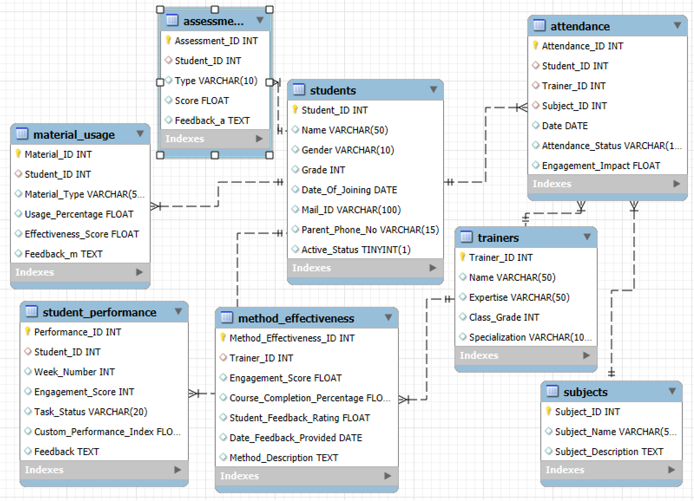

# 📊 Data Management System for Digital Literacy & AI Training  

This **Data Management System** was designed to support a **4-month training program** focused on **digital literacy, AI, and robotics** for students in **grades 6–12**. The system efficiently manages **attendance, performance, material usage, and teaching methodologies**, providing **real-time insights** to stakeholders.  

Built using **Python, PostgreSQL, and Power BI**, this project **automates data processing, storage, and visualization**, offering a **scalable** and **interactive dashboard** for efficient monitoring and decision-making.  

---

## 🚀 Key Features  

### 🔹 **Automated Data Processing**  
Developed Python scripts to streamline data ingestion and cleaning:  
- **Real-time File Monitoring** – Using the Watchdog library for instant updates.  
- **Data Cleaning & Validation** – Removing duplicates, handling missing values, and resolving inconsistencies.  
- **Standardized Formatting** – Converting datetime formats and ensuring dataset consistency.  

### 🔹 **Optimized Database Design**  
A **relational database** was designed to store all training-related data efficiently:  
- **Students** – Stores student profiles and contact details.  
- **Trainers** – Tracks trainers' expertise and assigned classes.  
- **Subjects** – Contains topics covered in training sessions.  
- **Attendance** – Logs daily student and trainer attendance.  
- **Performance** – Stores test scores, feedback, and KPIs.  
- **Material Usage** – Records resource utilization.  
- **Method Effectiveness** – Tracks engagement, completion rates, and feedback.  

🖼 **Database Design Preview**  
  

### 🔹 **Interactive Power BI Dashboards**  
Designed for **real-time analytics**, displaying:  
✅ **Attendance Trends & Engagement Metrics**  
✅ **Trainer & Student Performance Evaluation**  
✅ **Material Usage & Effectiveness Insights**  

🖼 **Power BI Dashboard Preview**  
.png)  

📌 **Live Dashboard:** [View Here](https://cool-mousse-bf94f2.netlify.app/)  

---

## 🛠 Tech Stack  

- **Python** – Watchdog (file monitoring), Pandas (data automation & analysis).  
- **PostgreSQL** – Optimized relational database for handling large datasets.  
- **Power BI** – Interactive dashboards for real-time insights.  
- **Netlify** – Hosting for live dashboard access.  

### 🔹 **Project Workflow**  
1. **Data Collection** – Imported from Excel sheets (dummy data generated via ChatGPT).  
2. **Automated Processing** – Python scripts clean and validate data.  
3. **Database Storage** – PostgreSQL stores structured datasets.  
4. **Dashboard Integration** – Power BI connects to SQL database for visualization.  
5. **Hosting** – Dashboards deployed online for stakeholder access.  

---

## 📈 Project Impact  

🔹 **Increased Efficiency** – Automation reduced manual data handling and improved workflow speed.  
🔹 **Data-Driven Insights** – Enabled real-time tracking of key performance metrics.  
🔹 **Scalability** – Designed to accommodate expanding datasets and future programs.  

---

## 🔮 Future Improvements  

🔹 **Predictive Analytics** – Integrating ML models for forecasting student performance.  
🔹 **Enhanced Dashboards** – More interactivity & faster data loading.  
🔹 **System Expansion** – Adapting the framework for additional training programs.  

---

## 📬 Contact  

📌 **Rushi Birewar**  
📧 **birewarrushi0@gmail.com**  

🚀 Explore this project, share your feedback, and let’s improve it together!  
